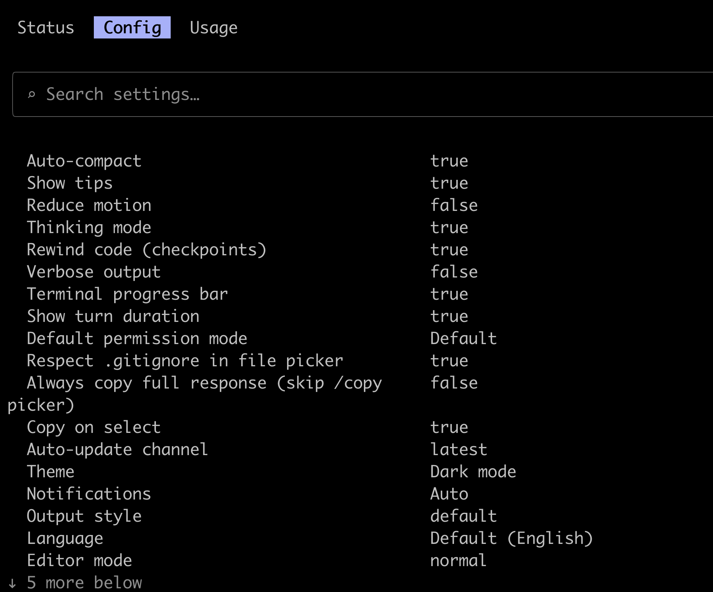

<div align="center">

# claude-status-bar

**Real-time status line for Claude Code.**

[](https://github.com/kangraemin/claude-status-bar/blob/main/LICENSE)
[](https://github.com/kangraemin/claude-status-bar/stargazers)

[Getting Started](#install) · [한국어](README.ko.md) · [Issues](https://github.com/kangraemin/claude-status-bar/issues)

</div>

---

Context usage, cost, model, git branch, version — two lines, always visible.



## Install

```bash
curl -fsSL https://raw.githubusercontent.com/kangraemin/claude-status-bar/main/install.sh | bash
```

Restart Claude Code. That's it.

## What You See

| | Info | Example |
|---|------|---------|
| 📁 | Directory | `my-project` |
| 🌿 | Git branch | `main` |
| 🧠 | Model | `Opus 4.6 (1M context)` |
| 📦 | Version | `v2.1.92` |
| 🧊 | Context used | `9% [=---------]` |
| 💰 | Session cost | `$3.62 ($11.65/h)` |

The context bar fills up as you use more — so you know when to `/compact` or start fresh.

## Update

```bash
curl -fsSL https://raw.githubusercontent.com/kangraemin/claude-status-bar/main/install.sh | bash
```

Same command. Overwrites the script, keeps your other settings.

## Uninstall

```bash
curl -fsSL https://raw.githubusercontent.com/kangraemin/claude-status-bar/main/uninstall.sh | bash
```

## How It Works

The installer does two things:

1. Copies `statusline.sh` → `~/.claude/statusline.sh`
2. Adds `statusLine` config to `~/.claude/settings.json`

```json
{
  "statusLine": {
    "type": "command",
    "command": "~/.claude/statusline.sh"
  }
}
```

Claude Code pipes session data as JSON to stdin. The script parses it with `jq` (preferred) or `python3` (fallback) and prints two lines.

## Requirements

- [Claude Code](https://docs.anthropic.com/en/docs/claude-code) CLI
- `jq` or `python3`

## License

MIT
